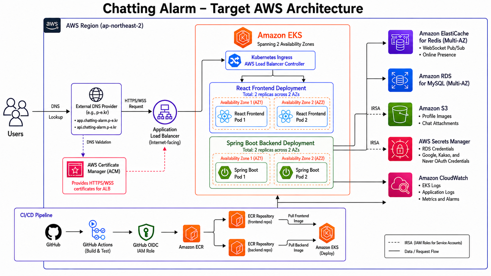
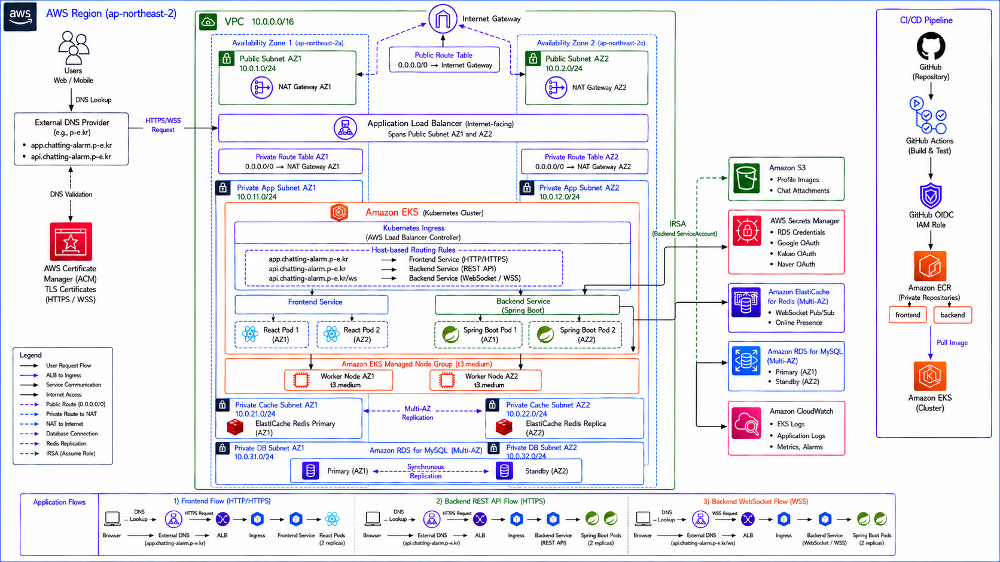

# Chatting Alarm

Spring Boot와 React로 만든 실시간 채팅 서비스입니다.

로컬에서는 Docker Compose로 실행하고, 운영 환경은 Terraform과 Kubernetes 매니페스트로 구성했습니다.

[](https://github.com/lty02-ops/chatting_alarm/actions/workflows/deploy.yml)

## 주요 기능

- Google, Naver, Kakao 소셜 로그인
- WebSocket/STOMP 기반 실시간 채팅
- 1:1 채팅과 단체 채팅방 생성
- 친구 코드로 요청을 보내고 상대방이 수락하는 친구 추가 방식
- 단체방 참여자 초대와 참여자 간 친구 요청
- 온라인 상태와 현재 접속자 표시
- 읽지 않은 메시지 알림
- 파일 첨부, 다운로드 및 메시지 이모지 반응
- 프로필 이름과 이미지 변경

## 아키텍처

### 전체 구성



DNS는 Route 53 대신 외부 DNS를 사용합니다. 사용자가 `app.chatting-alarm.p-e.kr` 또는 `api.chatting-alarm.p-e.kr`로 접속하면 ALB가 Kubernetes Ingress 규칙에 따라 프런트엔드와 백엔드로 요청을 나눠 보냅니다.

프런트엔드와 백엔드는 각각 두 개의 Pod로 구성했습니다. 한 가용 영역에만 Pod가 몰리지 않도록 topology spread constraint를 설정했고, 유지보수 중 두 Pod가 동시에 내려가지 않도록 PodDisruptionBudget도 추가했습니다.

### 상세 구성



VPC는 서울 리전의 두 가용 영역에 걸쳐 있습니다. ALB와 NAT Gateway는 Public Subnet에 두고, EKS Worker Node는 Private App Subnet에 배치했습니다. Redis와 RDS도 각각 전용 Private Subnet을 사용합니다.

채팅 메시지와 사용자 정보는 RDS MySQL에 저장합니다. Redis는 백엔드 Pod 사이에서 WebSocket 이벤트와 온라인 상태를 공유하기 위해 사용합니다. 프로필 이미지와 채팅 첨부파일은 S3에 저장합니다.

백엔드 Pod에 Access Key를 넣고 싶지 않아 S3와 Secrets Manager 접근에는 IRSA를 사용했습니다. Kubernetes ServiceAccount가 IAM Role을 맡고 필요한 시점에 임시 자격 증명을 받는 방식입니다.

CloudWatch에는 EKS와 애플리케이션 로그를 전송하고 RDS와 Redis의 주요 메트릭에 알람을 설정했습니다.

### CI/CD

```text
GitHub → GitHub Actions → GitHub OIDC → ECR → EKS
```

`main` 브랜치에 push하면 GitHub Actions가 백엔드 테스트와 프런트엔드 빌드를 확인합니다. 검사가 끝나면 프런트엔드와 백엔드 Docker 이미지를 각각 ECR에 올리고 EKS Deployment 이미지를 변경합니다.

AWS 인증에는 고정 Access Key 대신 GitHub OIDC를 사용했습니다.

## 사용 기술

### Application


### Infrastructure


- Backend: Java 17, Spring Boot, Spring Security, JPA, WebSocket/STOMP
- Frontend: React, Vite, SockJS, STOMP.js
- Data: MySQL, Redis, S3
- AWS: EKS, ECR, ALB, RDS, ElastiCache, S3, Secrets Manager, ACM, CloudWatch
- IaC/CI: Terraform, Kubernetes, Docker, GitHub Actions


## 로컬 실행

`.env.example`을 복사한 뒤 각 소셜 로그인 Client 정보를 입력합니다.

```bash
cp .env.example .env
```

```env
GOOGLE_CLIENT_ID=
GOOGLE_CLIENT_SECRET=

NAVER_CLIENT_ID=
NAVER_CLIENT_SECRET=

KAKAO_CLIENT_ID=
KAKAO_CLIENT_SECRET=
```

로컬 Callback URL은 다음과 같이 등록했습니다.

```text
Google: http://localhost:8000/login/oauth2/code/google
Naver:  http://localhost:8000/login/oauth2/code/naver
Kakao:  http://localhost:8000/login/oauth2/code/kakao
```

실행:

```bash
docker compose up --build
```

브라우저에서 `http://localhost:3000`으로 접속합니다. 백엔드는 `http://localhost:8000`에서 실행됩니다.

종료:

```bash
docker compose down
```

로컬 DB와 업로드 파일까지 지우려면 `-v` 옵션을 추가합니다.

```bash
docker compose down -v
```

## AWS 배포

> EKS, NAT Gateway, ALB, RDS Multi-AZ, ElastiCache 등은 실행 시간 동안 비용이 발생합니다.

### Terraform

Terraform state를 저장할 S3 버킷은 Terraform 밖에서 먼저 생성합니다. 버킷 이름은 전역에서 유일해야 하며, 생성한 이름을 `infra/aws/backend.tf`에 입력합니다.

```bash
aws s3api create-bucket \
  --bucket chatting-alarm-terraform-state-UNIQUE_SUFFIX \
  --region ap-northeast-2 \
  --create-bucket-configuration LocationConstraint=ap-northeast-2

aws s3api put-bucket-versioning \
  --bucket chatting-alarm-terraform-state-UNIQUE_SUFFIX \
  --versioning-configuration Status=Enabled
```

변수 파일을 만들고 인프라를 배포합니다.

```bash
cd infra/aws
cp terraform.tfvars.example terraform.tfvars

terraform init -reconfigure
terraform fmt -check
terraform validate
terraform plan
terraform apply
```

ACM 인증서가 `PENDING_VALIDATION` 상태라면 출력된 CNAME을 외부 DNS에 등록합니다.

```bash
terraform output acm_dns_validation_records
```

Terraform이 만든 `chatting-alarm/dev/backend` Secret에는 Google, Kakao, Naver의 Client ID와 Secret을 입력합니다. 실제 값은 `tfvars`, Kubernetes YAML 또는 Git 저장소에 넣지 않습니다.

### 초기 이미지와 Kubernetes 배포

최초 배포에서는 Kubernetes가 사용할 이미지가 ECR에 아직 없기 때문에 한 번 직접 올립니다. 아래 명령은 프로젝트 루트에서 실행합니다.

```bash
AWS_REGION=ap-northeast-2
AWS_ACCOUNT_ID="$(aws sts get-caller-identity --query Account --output text)"
IMAGE_TAG=bootstrap

BACKEND_REPOSITORY="$(terraform -chdir=infra/aws output -raw backend_ecr_repository_url)"
FRONTEND_REPOSITORY="$(terraform -chdir=infra/aws output -raw frontend_ecr_repository_url)"

aws ecr get-login-password --region "$AWS_REGION" \
  | docker login --username AWS --password-stdin \
      "$AWS_ACCOUNT_ID.dkr.ecr.$AWS_REGION.amazonaws.com"

docker build -t "$BACKEND_REPOSITORY:$IMAGE_TAG" backend
docker build \
  --build-arg VITE_API_BASE_URL=https://api.chatting-alarm.p-e.kr \
  -t "$FRONTEND_REPOSITORY:$IMAGE_TAG" frontend

docker push "$BACKEND_REPOSITORY:$IMAGE_TAG"
docker push "$FRONTEND_REPOSITORY:$IMAGE_TAG"
```

EKS kubeconfig을 만든 뒤 매니페스트를 적용합니다.

```bash
aws eks update-kubeconfig \
  --region ap-northeast-2 \
  --name "$(terraform -chdir=infra/aws output -raw eks_cluster_name)"

cd infra/kubernetes
chmod +x apply.sh
IMAGE_TAG=bootstrap ./apply.sh
```

`apply.sh`는 Terraform output을 읽어 ECR URL, RDS와 Redis endpoint, S3 bucket, IAM Role ARN, ACM ARN을 매니페스트에 넣습니다.

```bash
kubectl get pods -n chatting-alarm
kubectl get services -n chatting-alarm
kubectl get ingress -n chatting-alarm
```

GitHub Actions에서 사용할 IAM Role ARN은 Repository Variable로 등록합니다.

```bash
terraform -chdir=infra/aws output -raw github_actions_role_arn
```

```text
Settings → Secrets and variables → Actions → Variables
Name: AWS_DEPLOY_ROLE_ARN
```

## 인프라 제거

Ingress가 만든 ALB와 Security Group이 남아 있으면 VPC를 지울 수 없기 때문에 Kubernetes 리소스를 먼저 삭제합니다.

```bash
kubectl delete namespace chatting-alarm
```

ALB가 삭제된 것을 확인한 뒤 Terraform 리소스를 제거합니다.

```bash
cd infra/aws
terraform plan -destroy
terraform destroy
```

State용 S3 버킷은 Terraform 밖에서 만들었기 때문에 마지막에 별도로 비우고 삭제합니다.

## TROUBLE SHOOTING

### ALB Controller가 시작되지 않던 문제

처음 ALB Controller를 배포했을 때 VPC ID를 EC2 Instance Metadata에서 가져오지 못해 `context deadline exceeded`가 발생했습니다. Worker Node의 메타데이터 설정만 바꾸는 대신 Controller 실행 인수에 `--aws-vpc-id`를 직접 전달했습니다. VPC ID는 하드코딩하지 않고 Terraform output에서 넣도록 했습니다.

### GitHub Actions OIDC 인증 실패

GitHub Actions에서 `sts:AssumeRoleWithWebIdentity` 권한 오류가 났습니다. Policy 권한 문제라고 생각했지만 실제 원인은 IAM Role Trust Policy의 `sub` 조건이 GitHub가 발급한 토큰과 맞지 않았던 것이었습니다.

CloudTrail에서 실제 subject 값을 확인한 뒤 repository와 branch 조건을 수정했습니다. 이 과정에서 Role의 권한 Policy뿐 아니라 누가 Role을 맡을 수 있는지를 정하는 Trust Policy도 같이 확인해야 한다는 것을 알게 됐습니다.

### 로컬에서는 되는데 EKS에서 파일 전송이 실패한 문제

S3 권한과 IRSA Role은 정상인데 EKS에서만 파일 첨부가 실패했습니다. 로그를 확인해 보니 AWS SDK가 Web Identity Token으로 자격 증명을 만들 때 필요한 STS 모듈을 찾지 못하고 있었습니다.

백엔드에 AWS SDK STS 의존성을 추가한 뒤 Access Key 없이 IRSA로 S3에 파일을 올릴 수 있었습니다.

### 새 Pod가 Pending 상태에서 멈춘 문제

두 개의 `t3.small` 노드에서 RollingUpdate를 실행할 때 기존 Pod와 새 Pod를 동시에 배치할 공간이 부족했습니다. 노드를 `t3.medium`으로 조정하고 프런트엔드 Deployment의 전략을 `maxUnavailable: 1`, `maxSurge: 0`으로 바꿨습니다. 새 Pod를 무조건 먼저 추가하지 않고 기존 Pod 하나를 내린 뒤 교체하도록 한 것입니다.

## 아쉬운 점

- 노드 그룹의 최대 크기는 늘려 두었지만 Cluster Autoscaler나 Karpenter는 아직 적용하지 않았습니다.
- GitHub Actions는 이미지 교체까지 자동화하지만 Kubernetes 매니페스트 변경 전체를 자동으로 반영하지는 않습니다.
- 외부 DNS와 ACM 검증 레코드는 직접 관리합니다.
- 로컬 환경은 MySQL과 파일 볼륨만 사용하기 때문에 AWS의 Redis 및 Multi-AZ 환경까지 똑같이 재현하지는 않습니다.

## 개발자

- GitHub: [lty02-ops](https://github.com/lty02-ops)
